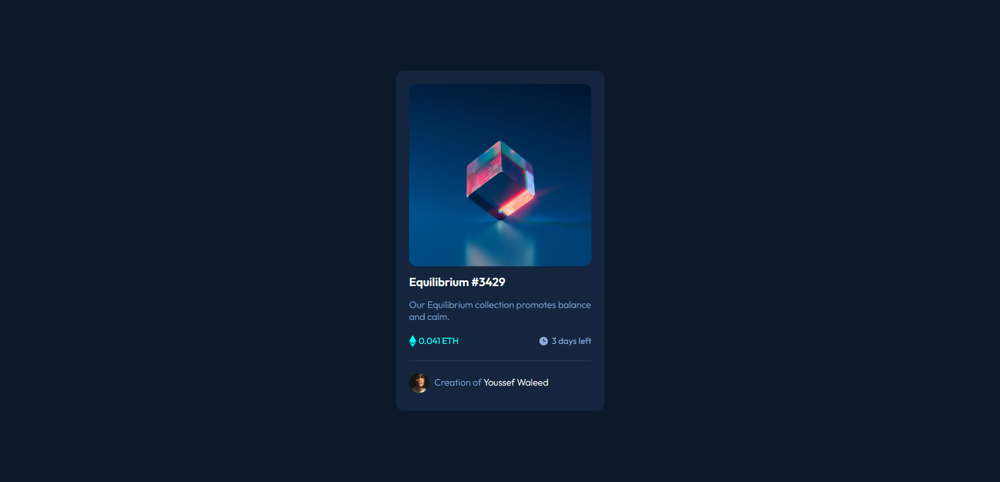
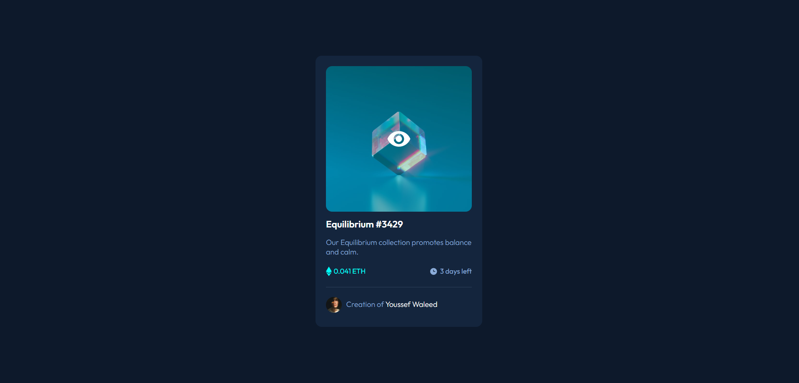

# Frontend Mentor - NFT preview card component solution

This is a solution to the [NFT preview card component challenge on Frontend Mentor](https://www.frontendmentor.io/challenges/nft-preview-card-component-SbdUL_w0U). Frontend Mentor challenges help you improve your coding skills by building realistic projects.

## Table of contents

-   [Overview](#overview)
    -   [The challenge](#the-challenge)
    -   [Screenshot](#screenshot)
    -   [Links](#links)
-   [My process](#my-process)
    -   [Built with](#built-with)
    -   [What I learned](#what-i-learned)
-   [Author](#author)

## Overview

### The challenge

Users should be able to:

-   View the optimal layout depending on their device's screen size
-   See hover states for interactive elements

### Screenshot




### Links

-   [Solution URL](https://github.com/ywsoliman/NFT-Card)
-   [Live Site URL](https://ywsoliman.github.io/NFT-Card/)

## My process

### Built with

-   HTML
-   CSS
    -   Flexbox
    -   Position
    -   Transition

### What I learned

```css
main .image .image-overlay {
    position: absolute;
    top: 0;
    left: 0;
    width: 100%;
    height: 100%;
    background-color: rgba(0, 255, 247, 0.3);
    display: flex;
    justify-content: center;
    align-items: center;
    opacity: 0;
    transition-duration: 0.5s;
    cursor: pointer;
}
```

## Author

-   Frontend Mentor - [@ywsoliman](https://www.frontendmentor.io/profile/ywsoliman)
-   Linkedin - [@ywsoliman](https://www.linkedin.com/in/ywsoliman/)
